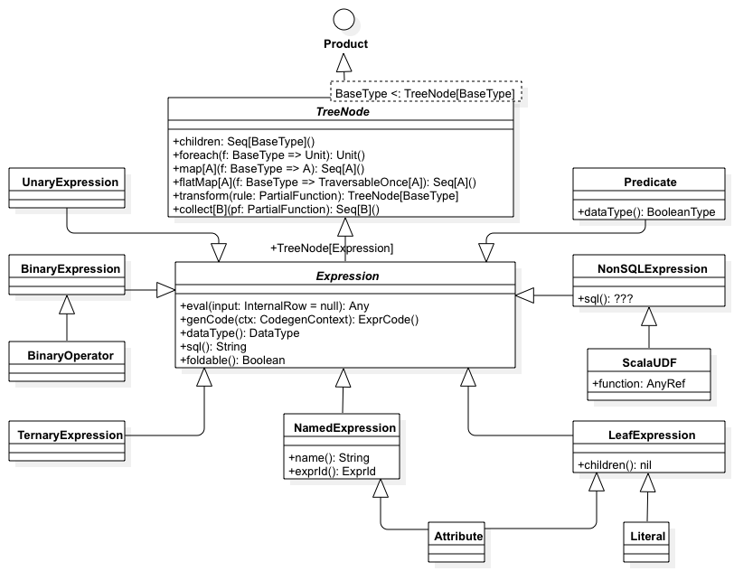
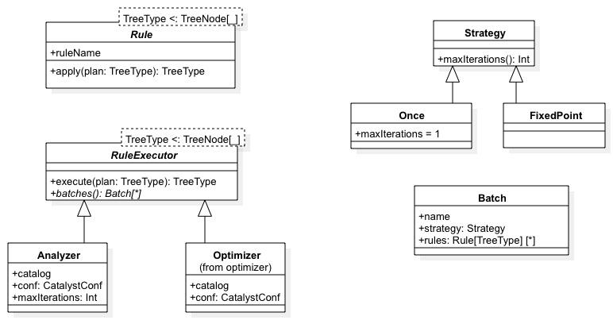

# Spark Catalyst Description and Usage


1. [Introduction](#introduction)
2. [Catalyst basic types, structures and hierarchies](#catalyst-basic-types-structures-and-hierarchies)
    * [TreeNode](#treenode)
    * [Expressions](#expressions)
    * [Rules](#rules)
    * [Plans](#plans)
3. [Catalyst workflow](#catalyst-workflow)
    * [Creating logical plans](#creating-logical-plans)
    * [Analyzing the logical plans](#analyzing-the-logical-plans)
    * [Optimizing the logical plans](#optimizing-the-logical-plans)
    * [Transforming a logical plan into a physical plan](#transforming-a-logical-plan-into-a-physical-plan)
    * [Choosing a Spark physical plan](#choosing-a-spark-physical-plan)
    * [Generating the code](#generating-the-code)
    * [Executing the Spark physical plan](#executing-the-spark-physical-plan)


## Introduction

This is, or rather might be, a presentations of the Catalyst code structure, and basic usage.

The current status of the research: ***WIP*** (and not RIP). **NOT TO BE USED BY HUMANS JUST YET!**

The code available is raw, barely documented and far from being readable, but we might get there.
For better code structure and better explanations I suggest [anatomy-of-spark-catalyst](https://github.com/phatak-dev/anatomy-of-spark-catalyst).

Some slides from an initial presentation are available [here](docs/SparkCatalyst.pdf).


## Catalyst basic types, structures and hierarchies

### TreeNode

***TBD***

- TreeNode is the main data type in Catalyst.
- TreeNodes are immutable.
- TreeNodes can be manipulated through recursive functional transformations (e.g. map, flatMap, foreach, transform…).
- TreeNode has two main implementations: Expression and QueryPlan.
- ThreeNode is not serializable, but the implementations are.

### Expressions

***TBD***



### Rules

***TBD***



### Plans

***TBD***


## Catalyst Workflow


### Creating logical plans

***TBD***

As the workflow diagram shows, there are two main methods to create a QueryPlan:

1. From a DataFrame / Dataset
2. By parsing a SQL text

#### Creating logical plans form a Dataset

```scala
type DataFrame = Dataset[Row]
```

"A Dataset is a strongly typed collection of domain-specific objects that can be transformed
in parallel using functional or relational operations. Each Dataset also has an untyped view
called a [[DataFrame]], which is a Dataset of [[Row]]."

"Datasets are "lazy", i.e. computations are only triggered when an action is invoked. Internally,
a Dataset represents a logical plan that describes the computation required to produce the data.
When an action is invoked, Spark's query optimizer optimizes the logical plan and generates a
physical plan for efficient execution in a parallel and distributed manner. To explore the
logical plan as well as optimized physical plan, use the `explain` function."

```scala
class Dataset[T] private[sql](
    @transient val sparkSession: SparkSession,
    @DeveloperApi @transient val queryExecution: QueryExecution,
    encoder: Encoder[T])
  extends Serializable {
  
  ...
    def this(sparkSession: SparkSession, logicalPlan: LogicalPlan, encoder: Encoder[T]) = {
      this(sparkSession, sparkSession.sessionState.executePlan(logicalPlan), encoder)
    }
  ...
```

We notice that the default constructor is private, but there is one public constructor that can be used.
If we have a look on how the Datasets are created we notice a few simple use cases is `SparkSession`:

```scala
...
  def emptyDataset[T: Encoder]: Dataset[T] = {
    val encoder = implicitly[Encoder[T]]
    new Dataset(self, LocalRelation(encoder.schema.toAttributes), encoder)
  }
...
  def createDataset[T : Encoder](data: Seq[T]): Dataset[T] = {
    val enc = encoderFor[T]
    val attributes = enc.schema.toAttributes
    val encoded = data.map(d => enc.toRow(d).copy())
    val plan = new LocalRelation(attributes, encoded)
    Dataset[T](self, plan)
  }
...
  def createDataset[T : Encoder](data: RDD[T]): Dataset[T] = {
    val enc = encoderFor[T]
    val attributes = enc.schema.toAttributes
    val encoded = data.map(d => enc.toRow(d))
    val plan = LogicalRDD(attributes, encoded)(self)
    Dataset[T](self, plan)
  }
```


```scala
class QueryExecution(val sparkSession: SparkSession, val logical: LogicalPlan) {
  ...
  lazy val analyzed: LogicalPlan = {
    SparkSession.setActiveSession(sparkSession)
    sparkSession.sessionState.analyzer.execute(logical)
  }
  ...
  lazy val optimizedPlan: LogicalPlan = sparkSession.sessionState.optimizer.execute(withCachedData)
  ...
  
  lazy val sparkPlan: SparkPlan = {
    SparkSession.setActiveSession(sparkSession)
    planner.plan(ReturnAnswer(optimizedPlan)).next()
  }
  ...
  
  // executedPlan should not be used to initialize any SparkPlan. It should be
  // only used for execution.
  lazy val executedPlan: SparkPlan = prepareForExecution(sparkPlan)

}
```


#### Creating logical plans by parsing a SQL query

***TBD***


### Analyzing the logical plans

***TBD***


### Optimizing the logical plans

***TBD***


### Transforming a logical plan into a physical plan

***Also known as "Let's get physical..."***

***TBD***


### Choosing a Spark physical plan

***TBD***


### Generating the code

***TBD***


### Executing the Spark physical plan

***TBD***


## Other notes and thoughts

- Look into removing the spark-core dependency from Catalyst; [see this discussion](apache-spark-user-list.1001560.n3.nabble.com/Catalyst-dependency-on-Spark-Core-td9581.html).
- Find the best way to deliver the logic:
    - source code
    - compiled binary
    - serialised plans
- Test more complex transformations - Actively Working On This
- Test more complex input structures - TODO


## References:
 
[Spark SQL: Relational Data Processing in Spark](http://people.csail.mit.edu/matei/papers/2015/sigmod_spark_sql.pdf)

[SPARK-1251 Catalyst](https://spark-project.atlassian.net/browse/SPARK-1251)

[SPARK-12795 Whole stage codegen](https://issues.apache.org/jira/browse/SPARK-12795)

[Deep Dive into Spark SQL’s Catalyst Optimizer](https://databricks.com/blog/2015/04/13/deep-dive-into-spark-sqls-catalyst-optimizer.html)

[Apache Spark as a Compiler](https://databricks.com/blog/2016/05/23/apache-spark-as-a-compiler-joining-a-billion-rows-per-second-on-a-laptop.html)
 
[anatomy-of-spark-catalyst](https://github.com/phatak-dev/anatomy-of-spark-catalyst)
